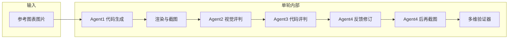

<<<<<<< HEAD
# 多智能体图表复现框架（Python）

基于阿里云 **DashScope（通义）** API 的多智能体流水线：从参考图表图片出发，生成 **ECharts 内联 JavaScript**，经视觉评判、代码评判与反馈修订后，由多维验证器判定是否达标，并支持多轮迭代优化。

---

## 功能概览

| 组件 | 说明 |
|------|------|
| **Agent 1** | 多模态模型（VLM）读图，生成可在浏览器中运行的 ECharts 脚本（容器 `#main`，全局 `echarts`） |
| **Agent 2** | VLM 对比「原图」与「复现截图」，输出图表评估报告 |
| **Agent 3** | 文本大模型（LLM）结合代码与图表报告，输出代码评判与改进建议 |
| **Agent 4** | LLM 综合「代码评估 + 图表评估」，输出修改后的完整 JS |
| **多维验证器** | VLM 对原图与复现图打分，判断是否达到阈值 |

首轮由 Agent1 生成代码；若验证未通过，后续轮次在上一轮 **Agent4** 的输出上继续 **Agent2 → Agent3 → Agent4 → 验证**，不再重复调用 Agent1（除非自行修改 `agent_pipeline.py`）。

---

## 流程说明

### 总体数据流



- **Agent1**：输入为参考图路径，输出为 **ECharts 内联 JS**（浏览器环境，容器 `#main`）。
- **渲染**：`echarts_render.py` 将 JS 嵌入带 CDN 的 HTML，用 **Playwright** 截图为 PNG，得到「生成图表」图像。
- **Agent2**：输入为 **原图 + 生成图**，输出 **图表评估报告**（图像评判）。
- **Agent3**：输入为 **当前 JS + Agent2 报告**，输出 **代码评估报告**（可读性、模块化、可测试性及改进指导）。
- **Agent4**：输入为 **当前 JS + Agent3 报告 + Agent2 报告**，输出 **修改后的完整 JS**。
- **验证器**：对比 **原图与 Agent4 后渲染的 PNG**，输出分数与是否通过；未通过则进入下一轮迭代。

### 单轮内部顺序（与 `agent_pipeline.py` 一致）

1. **第 1 轮**：调用 Agent1 根据参考图生成代码 → 写入 `current_echarts.js` → 渲染并截图 → Agent2 → Agent3 → Agent4 → 对 Agent4 输出再渲染截图 → 多维验证器。
2. **第 2 轮及以后**：不再调用 Agent1，直接以上一轮 **Agent4 输出的 JS** 作为当前代码，重复：**渲染截图 → Agent2 → Agent3 → Agent4 → 再渲染 → 验证器**。
3. 若验证通过或达到 `--max-loops` 上限，流程结束；通过时最终代码写入 `outputs/current_echarts.js`。

### 模型分工

| 环节 | 模型类型 | 默认模型（可在代码中调整） |
|------|----------|----------------------------|
| Agent1、Agent2、验证器 | 多模态 VLM | `qwen-vl-max` |
| Agent3、Agent4 | 文本 LLM | `qwen-plus` |

---

## 执行步骤

按顺序完成下列步骤即可从零跑通流水线。

| 步骤 | 操作 |
|------|------|
| 1 | 进入项目根目录（与 `main.py` 同级）。 |
| 2 | 安装依赖：`pip install -r requirements.txt`。 |
| 3 | 安装浏览器内核：`playwright install chromium`（用于 ECharts 截图）。 |
| 4 | 配置环境变量 `DASHSCOPE_API_KEY`（阿里云百炼/灵积 API Key，勿提交到仓库）。 |
| 5 | 准备一张参考图，建议命名为 `input.png` 放在项目根目录（或使用 `-i` 指定任意路径）。 |
| 6 | 执行：`python main.py -i input.png -o outputs --max-loops 5 --threshold 0.75`。 |
| 7 | 在 `outputs/` 查看 `current_echarts.js`、`preview.html`、`generated_chart.png` 及各轮 `report_agent2_*`、`report_agent3_*`、`validator_round*`。 |
| 8 | 若控制台提示截图失败，检查网络（需访问 ECharts CDN）并确认 Playwright 已正确安装。 |

**可选**：仅体验通义多模态对话、不跑完整流水线时，可在项目根目录执行 `python agents.py`（按提示使用 `TextChat` / `ImageChat`），同样需要配置 `DASHSCOPE_API_KEY`。

> 说明：仓库中的 `执行步骤.md` 可能包含早期示例（如 matplotlib 方案）；**当前主线实现以本 README 与 `agent_pipeline.py` 为准**（ECharts + Playwright + DashScope）。

---

## 环境要求

- Python 3.9+（建议）
- 阿里云百炼 / DashScope **API Key**（环境变量，勿写入代码仓库）
- **Playwright** 与 **Chromium**（用于将 HTML 中的 ECharts 渲染为 PNG，供 Agent2 与验证器使用）

---

## 安装

```bash
cd "项目根目录"
pip install -r requirements.txt
playwright install chromium
```

设置 API Key（Windows PowerShell 示例）：

```powershell
$env:DASHSCOPE_API_KEY = "你的API_Key"
```

Linux / macOS：

```bash
export DASHSCOPE_API_KEY="你的API_Key"
```

---

## 运行

将参考图表保存为图片（默认文件名 `input.png`，放在项目根目录），执行：

```bash
python main.py -i input.png -o outputs --max-loops 5 --threshold 0.75
```

### 命令行参数

| 参数 | 含义 | 默认值 |
=======
# 多智能体图表复现框架

基于阿里云 DashScope API 的多智能体流水线，从参考图表自动生成 Matplotlib 代码，通过多轮迭代优化实现高质量图表复现。

## 核心功能

- **Agent 1**：多模态模型读图生成 Matplotlib 代码
- **Agent 2**：视觉差异评估（颜色、坐标轴、文本、趋势）
- **Agent 3**：代码修正指导
- **Agent 4**：融合反馈执行渐进式修订
- **多维验证器**：VLM + 算法融合打分（颜色/文本/结构一致性，支持图表类型自适应）

## 快速开始

### 1. 环境要求

- Python 3.9+
- 阿里云 DashScope API Key
- Tesseract OCR（用于文本一致性验证）

### 2. 安装依赖

```bash
cd MultiAgentFrame-main
pip install -r requirements.txt
```

### 3. 配置环境变量

在项目根目录创建或编辑 `.env` 文件：

```env
DASHSCOPE_API_KEY=your_api_key_here
TESSERACT_CMD=your_tesseract_path_here
```

需要先安装 [Tesseract OCR](https://github.com/UB-Mannheim/tesseract/wiki)，然后在 `.env` 中配置正确的安装路径。

### 4. 运行

准备参考图表（如 `data/test.png`），执行：

```bash
python experiments/main.py -i data/test.png -o outputs --max-loops 5 --threshold 0.75
```

### 5. 查看结果

输出目录 `outputs/` 包含：
- `current_echarts.js`：生成的 ECharts 代码
- `preview.html`：可在浏览器中预览
- `generated_chart.png`：渲染截图
- `report_agent2_*.txt`、`report_agent3_*.txt`：各轮评判报告
- `validator_round*.txt`：验证结果

## 命令行参数

| 参数 | 说明 | 默认值 |
>>>>>>> a215fee9df5233340252adb631ac98727fe6dc09
|------|------|--------|
| `-i` / `--input` | 输入参考图路径 | `input.png` |
| `-o` / `--out` | 输出目录 | `outputs` |
| `--max-loops` | 最大迭代轮数 | `5` |
<<<<<<< HEAD
| `--threshold` | 验证器通过分数阈值（0～1） | `0.75` |

---

## 项目内 Python 文件说明

### 核心流水线（推荐使用）

| 文件 | 作用 |
|------|------|
| `main.py` | 命令行入口，解析参数并调用 `run_full_pipeline` |
| `agent_pipeline.py` | 串联 Agent1～4 与验证器，控制多轮循环 |
| `dashscope_api.py` | API Key 读取、VLM/LLM 调用、从模型回复中提取 JS |
| `agent1_code_generation.py` | Agent1：读图生成 ECharts JS |
| `agent2_visual_judgment.py` | Agent2：双图视觉评判报告 |
| `agent3_code_evaluation.py` | Agent3：代码评估报告 |
| `agent4_feedback_revision.py` | Agent4：反馈优化后的 JS |
| `echarts_render.py` | 将 JS 嵌入 HTML（CDN 引入 ECharts），Playwright 截图 |
| `multidim_validator.py` | 多维验证：原图 vs 复现图打分 |

### 其他脚本

| 文件 | 作用 |
|------|------|
| `agents.py` | 交互式 `TextChat` / `ImageChat` 示例（通义 API） |
| `ImageChat.py` | 单文件版图片对话示例（运行即调用） |
| `VisualJudgement.py` | 早期视觉相关示例（若存在未定义变量需自行修正后再用） |
| `图片复现.py` | 使用 PyECharts 生成示例环形图的独立脚本 |

---

## 输出目录（`outputs/` 示例）

运行后可能在输出目录生成（具体以 `agent_pipeline.py` 为准）：

- `current_echarts.js`：当前/最终 ECharts 内联脚本
- `preview.html`：用于本地预览与截图的 HTML
- `generated_chart.png`：最近一次渲染截图
- `report_agent2_round*.txt`、`report_agent3_round*.txt`：各轮评判报告
- `current_echarts_after_agent4_r*.js`：各轮 Agent4 输出备份
- `validator_round*.txt`：各轮验证结果摘要

---

## 常见问题

1. **提示找不到 `DASHSCOPE_API_KEY`**  
   请先在当前终端/系统中正确设置环境变量后再运行。

2. **截图失败或 Agent2/验证器无法工作**  
   确认已执行 `pip install playwright` 与 `playwright install chromium`，且本机网络可访问 ECharts CDN。

3. **验证分数不稳定**  
   多模态与文本模型输出存在随机性，可适当调整 `--threshold` 或 `--max-loops`。

---

## 依赖列表

见项目根目录 `requirements.txt`（主要包含 `dashscope`、`playwright`）。
=======
| `--threshold` | 验证通过阈值（0~1） | `0.75` |

## 依赖说明

主要依赖（详见 `requirements.txt`）：
- `dashscope`：阿里云 API
- `playwright`：浏览器自动化
- `pytesseract`：OCR 文本识别
- `numpy`、`Pillow`：图像处理
- `python-dotenv`：环境变量管理
>>>>>>> a215fee9df5233340252adb631ac98727fe6dc09
